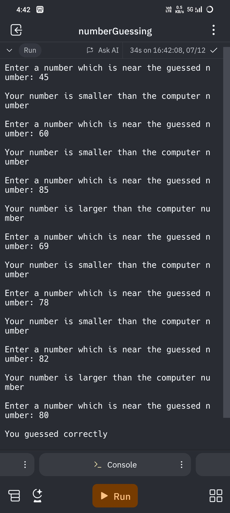

# Number Guessing Game

Welcome to the Number Guessing Game! This is a simple Python game where the computer randomly generates a number between 1 and 100, and the player tries to guess the number. The game provides feedback on whether the guessed number is higher or lower than the computer-generated number until the player guesses correctly.

## Features

- Randomly generates a number between 1 and 100.
- Provides feedback if the guessed number is higher or lower than the generated number.

## Installation

1. Clone the repository:
    ```sh
    git clone https://github.com/developer-adityaSingh/Number-Guessing.git
    ```

2. Navigate to the project directory:
    ```sh
    cd Number-Guessing
    ```

## Usage

1. Run the game:
    ```sh
    python main.py
    ```

2. Follow the on-screen instructions to play the game:
    - Enter a number between 1 and 100.
    - The game will provide feedback on whether your guess is too high or too low. Keep guessing until you find the correct number!

## Example

```plaintext
Enter a number which is near the guessed number: 45
Your number is smaller than the computer number

Enter a number which is near the guessed number: 60
Your number is smaller than the computer number

Enter a number which is near the guessed number: 85
Your number is larger than the computer number

Enter a number which is near the guessed number: 69
Your number is smaller than the computer number

Enter a number which is near the guessed number: 78
Your number is smaller than the computer number

Enter a number which is near the guessed number: 82
Your number is larger than the computer number

Enter a number which is near the guessed number: 80
You guessed correctly
```



Happy Guessing!


